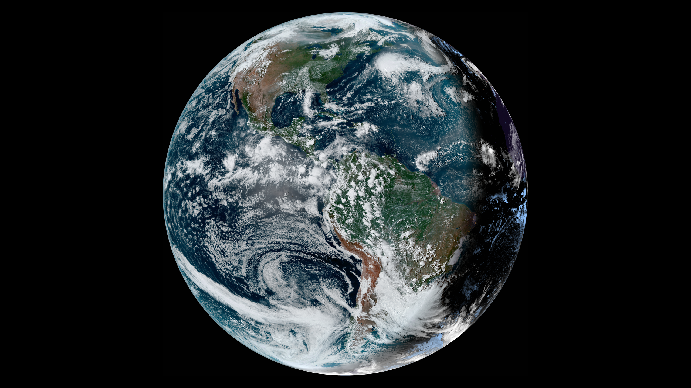
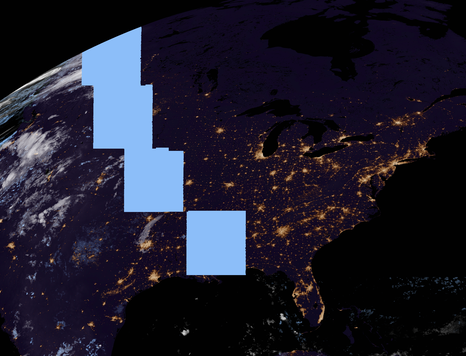

<h1 align="center">Satpaper</h1>
<h3 align="center">Display near-real-time satellite imagery on your desktop.</h3>

<p align="center">


</p>

<p align = "center">

<br>
<i> (Click to see full-size version) </i>
</p>

Satpaper generates live wallpapers for your desktop, using near-real-time imagery from [RAMMB SLIDER](https://rammb-slider.cira.colostate.edu).

There are several satellites to choose from, each covering a different region of the world.
- GOES East (used in the sample image - covers most of North and South America)
- GOES West (Pacific Ocean and parts of the western US)
- Himawari (Oceania and East Asia)
- Meteosat 9 (Africa, Middle East, India, Central Asia)
- Meteosat 10 (Atlantic Ocean, Africa, Europe)

It's also possible to specify a custom background image, if desired.

## Warning - Data Usage
Satpaper downloads satellite imagery at the highest available resolution and downscales it to fit your specifications. The exact download size varies depending on which satellite you are using and the image contents, but it's typically in the ballpark of twenty megabytes.

If you're on a metered and/or severely bandwidth-limited connection, twenty megabytes every ten to fifteen minutes can really add up. You have been warned!

## Installation
### Automatically Supported Environments
- GNOME
- KDE
- Windows (tested to work on 10/11)
- macOS (tested to work on Ventura)
    - Satpaper will ask for System Event permission when running for the first time - you will need to grant access then restart the program for it to work.

If your environment is not supported, you have a few options:
- Use the `--wallpaper-command`/`SATPAPER_WALLPAPER_COMMAND` argument to specify a command to run whenever a new wallpaper is generated. 
- Use the `--once` flag to turn Satpaper into a one-off wallpaper generator, allowing it to be integrated into a larger script or program.

PRs to add automatic support are also welcome!

### Precompiled Binaries
Precompiled versions of Satpaper are available for:
- Linux (compiled against `x86_64-unknown-linux-musl`, which should Just Work™ on most distributions) 
- Windows (compiled on Github actions `windows-latest`)
- macOS (compiled on Github actions `macos-latest`)

All binaries can be found in the [releases](https://github.com/Colonial-Dev/satpaper/releases) section. Additionally, please note that I'm only able to test the Linux binary - please open an issue if there's something wrong with the binary for your platform (doesn't work at all, only works on the newest version, whatever.)

### From Source

Dependencies:
- The most recent stable [Rust toolchain](https://rustup.rs/).
- A C/C++ toolchain (such as `gcc`.)

Just use `cargo install`, and Satpaper will be compiled and added to your `PATH`.
```sh
cargo install --locked --git https://github.com/Colonial-Dev/satpaper --branch master
```

To automatically start Satpaper when you log in, you can use a `systemd` unit or equivalent.

```
[Unit]
Description=Run Satpaper on login.

# You should adjust these values as needed/preferred.
[Service]
Environment=SATPAPER_SATELLITE=goes-east
Environment=SATPAPER_RESOLUTION_X=2560
Environment=SATPAPER_RESOLUTION_Y=1440
Environment=SATPAPER_DISK_SIZE=94
Environment=SATPAPER_TARGET_PATH=/var/home/colonial/.local/share/backgrounds/

ExecStart=/var/home/colonial/.cargo/bin/satpaper
Restart=on-failure
RestartSec=5

[Install]
WantedBy=default.target
```

```sh
# (Write out or paste in your unit file)
nano $HOME/.config/systemd/user/satpaper.service
systemctl --user enable satpaper
systemctl --user start satpaper
```

### Using Docker

Thanks to `cyberbit`, everything you need to build and run a Satpaper Docker image can be found in the `docker/` directory. 

## Command Line Options
### Basic/Required
- `-s`/`--satellite`/`SATPAPER_SATELLITE` - the satellite to source imagery from. 
    - Possible values: `goes-east`, `goes-west`, `himawari`, `meteosat9`, and `meteosat10`.
- `-x`/`--resolution-x`/`SATPAPER_RESOLUTION_X` (and equivalents for the `y` dimension) - the width/height of the generated wallpaper.
    - Any arbitary resolution should work, including vertical aspect ratios.
- `-d`/`--disk-size`/`SATPAPER_DISK_SIZE` - the size of the "disk" (Earth) relative to the generated wallpaper's smaller dimension.
    - Required to be an integer value in the range `[1, 100]` inclusive, mapping to a percentage value.
    - For most desktop environments, a value in the 90-95 range will give the most detail while preventing parts from being cut off by UI elements like taskbars.
- `-t`/`--target-path`/`SATPAPER_TARGET_PATH` - where the generated wallpaper should be saved.
    - Satpaper will output to a file called "satpaper_latest.png" at this path.
    - Example: if the argument is `/home/user/Pictures`, the output will be at `/home/user/Pictures/satpaper_latest.png`.

### Advanced
- `-b`/`--background-image`/`SATPAPER_BACKGROUND_IMAGE` - the path to an image to use as the background.
    - Most common image formats are supported.
    - For best results, the image should match the specified resolution, but Satpaper will resize the image to fit if need be.
    - Satpaper uses a basic "marching" algorithm to find the bounds of the Earth and apply transparency to the original image, but it's not perfect - some black bordering may remain.
    - An alternate flood-fill-based algorithm is available, and can be enabled by setting the environment variable `SATPAPER_ENABLE_FLOOD_FILL`. Flood filling is less CPU intensive and may give better results - the catch is that the fill may "eat into" the Earth at night. Consider this feature "experimental" and use at your own risk!
- `-w`/`--wallpaper-command`/`SATPAPER_WALLPAPER_COMMAND` - custom command to run when a wallpaper is generated.
    - This overrides the automatic update handling.
    - Currently, this only works on Unix. The command will be run as `sh -c "{command} file://{image_path}`.
- `-o`/`--once`/`SATPAPER_ONCE` - whether or not to only run once.
    - By default, Satpaper is designed to run as a daemon - it stays resident once launched and periodically attempts to update your wallpaper.
    - With `--once` set, Satpaper will generate one wallpaper and terminate, without altering your existing wallpaper.
    - This is ideal if you want to use Satpaper as a simple wallpaper generator or as part of a larger script/program.

## FAQ

### *Why is Satpaper using hundreds of megs of RAM?*

There are two possible causes:
- You're seeing RAM usage spike to 500+ megabytes whenever Satpaper is compositing a new wallpaper. This is expected and unavoidable - the raw satellite imagery alone is ~450 megabytes after being decompressed and stitched together. However, this spike should only last several seconds - once composition is complete, the image buffers are all freed, and `libmimalloc_sys::mi_collect` is called to ensure as much memory as possible is returned to the OS.
- You're using an early version of Satpaper. Early versions had issues with `libc`'s `free` deciding it was fine to just... not return multi-hundred-megabyte allocations to the OS, as well as the `tokio` runtime being fairly memory heavy. I resolved these issues by switching to `mimalloc` and transitioning away from async, so behavior *should* improve if you update.

### *Why are continents purple in night imagery?* / *Why does night imagery look kinda weird?*
This is a byproduct of the CIRA GeoColor processing algorithm used to generate full-color images from the raw satellite data. GeoColor uses infrared for night-time imaging, which is then overlaid with false city lights and whitened clouds. The resulting image usually looks pretty good at a glance, but might begin to seem unnatural upon closer inspection.

Unfortunately, this is a necessary evil, as geostationary weather satellites don't capture enough visible spectrum light to generate a true-color night-time image.

### *I live at `$EXTREME_LATITUDE` - is there a way to get better imagery of my location?*
Not really. Geostationary orbits (required for the type of imaging we want) can only be achieved at a very specific altitude directly above the equator.

### *Why am I seeing glitchy imagery from GOES East at night?*
You're most likely seeing something like this:
<p align="center">

<p>

This is not a software error, but is instead lens flare from the Sun peeking over from the other side of the Earth. This is caused by the Earth's tilt, and is most visible in late February and August.

You can find a more detailed explanation [here](https://www.reddit.com/r/WeatherGifs/comments/pj25ht/comment/hbvs1wo).
